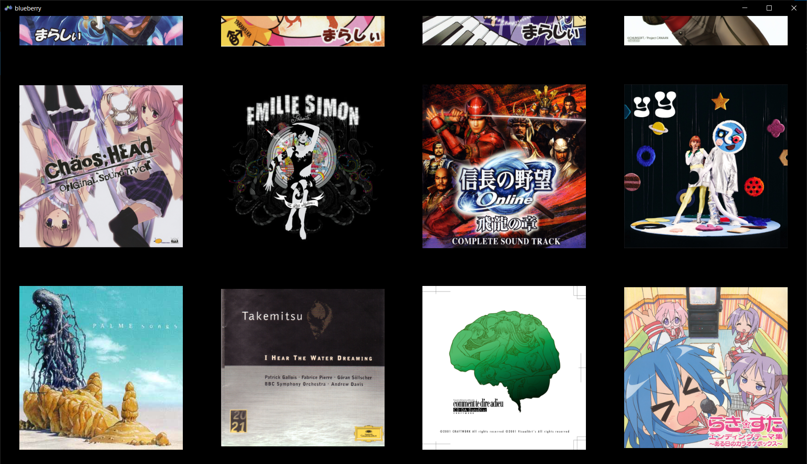
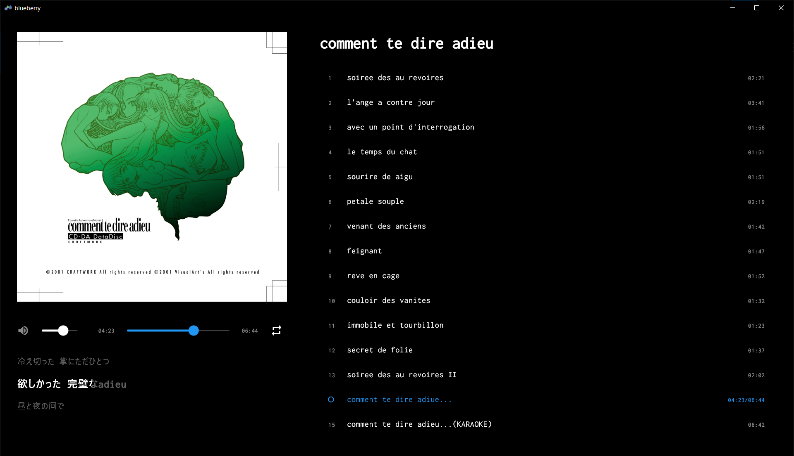

# Blueberry Music Player

A modern music player built with Flutter that focuses on album-based music playback with karaoke-style lyrics display.

## Preview


_Album grid view with cover art display_


_Music playback with karaoke-style lyrics_

## Features

- 🎵 Support for multiple audio formats (FLAC, APE, MP3, M4A, AAC, OGG, WAV, etc.)
- 📝 Real-time karaoke-style synchronized lyrics display
- 💿 Album-centric organization with cover art display
- 🎯 CUE sheet support for seamless album playback
- 🎨 Modern, minimalist dark UI design
- 🖼️ Grid-based album view with smooth scrolling
- 🎼 Automatic lyrics detection and online lyrics search
- 🔄 Background image caching for smooth performance
- ❤️ Track favorites system

## Installation

### Prerequisites

- Windows 10 or later
- [Flutter](https://flutter.dev/docs/get-started/install) (3.0.0 or higher)
- [Flutter Version Management (FVM)](https://fvm.app/) (optional but recommended)

### Setup

1. Clone the repository:

```bash
git clone https://github.com/yourusername/blueberry.git
cd blueberry
```

2. Install dependencies:

```bash
fvm flutter pub get
```

3. Run the app in development mode:

```bash
fvm flutter run -d windows
```

### Building for Production

To create a production build:

```bash
fvm flutter build windows
```

The built application will be available in `build/windows/runner/Release/`.

## Configuration

1. Create a config file at `%USERPROFILE%\AppData\Local\Blueberry\config.json`:

```json
{
  "folders": [
    {
      "path": "D:\\Music\\Albums"
    }
  ]
}
```

2. Library Organization:
   - Albums are automatically organized based on folder structure
   - CUE sheets are parsed for proper track splitting
   - Lyrics files (.lrc) are automatically detected and linked
   - Online lyrics search available for missing lyrics

## Folder Structure

The app expects your music to be organized in the following way:

```
Music Directory
├── Album1
│   ├── folder.jpg (or cover.jpg)
│   ├── 01. Track.flac
│   └── 01. Track.lrc
├── Album2
│   ├── folder.jpg
│   ├── album.cue
│   └── album.flac
```

## Development

The project uses the following key packages:

- `provider` for state management
- `media_kit` for audio playback
- `metadata_god` for audio metadata
- `flutter_phoenix` for app restart capability

## License

This project is licensed under the MIT License - see the LICENSE file for details.
